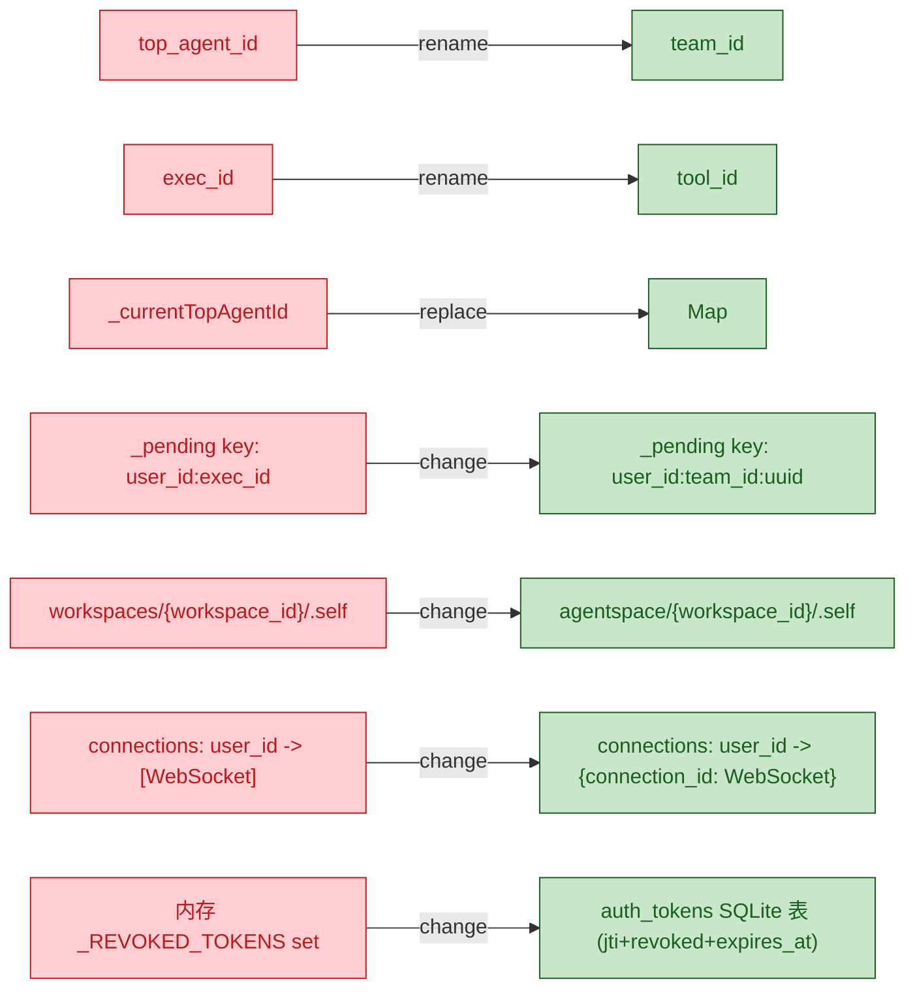
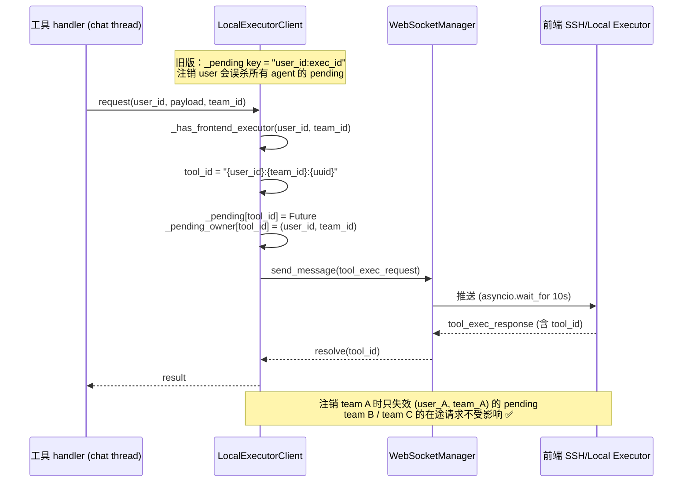
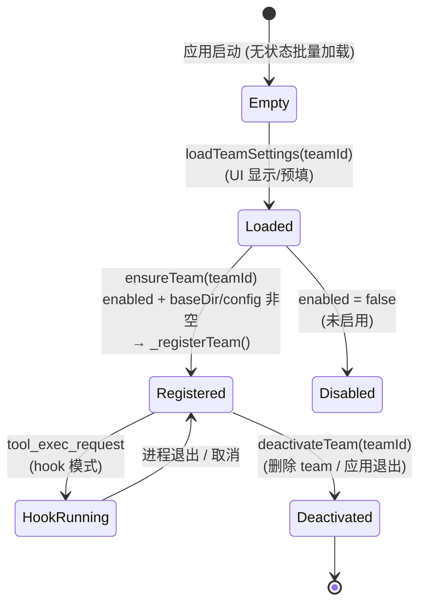

# Changelog

本文件记录 Agent Team Desktop 应用的所有变更。

格式参考 [Keep a Changelog](https://keepachangelog.com/zh-CN/)。

---

## [Unreleased] - 2026-08-12

### Added

#### 用户体验优化
- **Working 状态标识**：agent 工作时标题栏显示"工作中"动画与橙色标识
- **停止按钮**：工作期间可随时点击停止按钮取消当前任务（基于 `threading.Event` 的线程安全取消机制）
- **中间输出独立成消息**：agent 每次中间输出作为独立消息发送，不再合并为单条
- **工具调用折叠卡片**：每次工具调用以可折叠卡片展示（默认折叠），展开可查看参数与执行结果
- **内置工具定制卡片样式**：为每个内置工具（help/set/refresh/mcp/team/ask_user_question/read/write/edit/terminal/embed_search）配置专属图标、配色与标题
- **工具卡片人类可读参数**：展开后按工具类型格式化展示参数（文件路径、命令、操作类型等），不再显示原始 JSON
- **大输出可滚动容器**：terminal/read/mcp 等工具输出超过 200 字符时使用可滚动容器展示
- **重定向输出参数**：每个内置工具增加 `redirect_output` 参数，可将工具结果保存到工作空间内指定文件，返回保存提示
- **MCP 工具嵌套参数展示**：mcp 工具的 `tool_name` 与嵌套 `arguments`（如 `cmd`/`path`）展开为独立参数行
- **工具结果可读化**：后端 `_stringify_tool_result` 将 dict 结果格式化为人类可读文本（提取 content/message 字段或格式化为 `标签: 值` 行），不再显示原始 JSON
- **图片文件 base64 返回**：`get_file_content` 对图片文件（png/jpg/gif 等）返回 base64 编码内容，前端正确解码渲染

#### AskUserQuestion 内置工具
- 新增 `ask_user_question` 内置工具（非 MCP tool），允许 agent 在任务中向用户提问
- 支持 question/options/default_answer 参数
- 前端弹窗展示问题与选项，用户选择/输入后回传给 agent
- 超时自动使用默认答案或提示 agent 重新提问

#### Teammates 工作进度窗口
- 新增 teammates 拓扑可视化窗口，展示 leader 与成员的层级关系
- 每个成员卡片显示名称、实时工作状态（工作中/空闲）、模型、层级与评价
- 点击成员进入详情页，包含进度/日志/文件/消息四个 Tab
  - 进度：实时消息与工具调用卡片（WS 推送 + 历史加载）
  - 日志：成员工作空间的活动日志
  - 文件：成员沙箱文件浏览器（支持目录导航）
  - 消息：直接向成员发送消息
- 成员工作状态通过 WebSocket 实时更新（working/idle）
- 成员详情页支持 `DefaultTabController` 提供 Tab 切换

#### Compact 机制重新设计
- 保留最近 N 次用户要求原文（`KEEP_RECENT_USER_MSGS`），确保当前任务上下文完整
- 调用 LLM 总结更早的工具调用轨迹与任务上下文，生成 summary 消息替代
- 手动压缩按钮（compact）跳过阈值判断，强制执行压缩

#### 文件同步
- 实现 `syncToLocal` 接口：将工作空间文件打包（tar + base64）下载到本地
- 逐个解包 tar 成员，已存在文件覆盖、目录跳过创建，不删除目标目录中的其他文件
- 含路径穿越防护（拒绝 `../../` 之类的恶意路径）

#### 工具调用轨迹持久化
- 对话历史数据库新增 kind/tool_name/tool_arguments/tool_result 字段
- 中间文本输出与工具调用结果实时写入历史，重启后不丢失
- 前端加载历史时自动渲染工具调用卡片

### Fixed

- **`surfaceContainerHighest` 编译错误**：Flutter 3.7.12 不支持该 getter，替换为 `surfaceVariant`
- **`Not a constant expression`**：`_toolStyle` default 分支字符串插值不能用于 `const`，去掉 `const`
- **`No TabController for TabBar`**：teammates 详情页用 `DefaultTabController` 包裹 Scaffold
- **team_broker 事件循环错误**：`dispatch()` 在 chat 消费线程中调用时无 running loop，改为构造时捕获主事件循环引用，使用 `run_coroutine_threadsafe` 调度
- **服务关停时 worker 异常日志**：`_on_worker_done` 未捕获 `concurrent.futures.CancelledError`，补充捕获
- **teammates 沙箱文件目录无法点击**：`_MemberFileBrowser` 缺少目录导航逻辑，增加 `onTap` 与面包屑导航
- **teammate 进度页一直为空**：成员处理流程不写历史且前端不加载历史，后端补 `_store_message`、前端补 `getConversationHistory`
- **teammate 卡住不动**：成员会话创建时缺少 `_register_tools`，LLM 无法调用任何工具
- **消息列表频繁滑到底部**：添加 `_nearBottom` 标志，仅在用户已处于底部附近时才跟随滚动
- **teammate 状态不实时更新**：拓扑页增加 WebSocket 连接，监听 `agent_status` 事件维护 `_workingMembers` 集合
- **syncToLocal 重复同步报错**：改为逐个解包 tar 成员，不再清空目标目录
- **工具卡片显示原始 JSON**：后端 `str(result)` 将 dict 转为 Python dict 字符串，前端无法可靠解析；改为后端 `_stringify_tool_result` 统一提取可读内容
- **MCP 工具参数不显示**：mcp 工具参数为嵌套结构（`tool_name` + `arguments`），之前只取不存在的 `tool` 键，改为正确解析嵌套参数
- **PNG 图片无法渲染**：`get_file_content` 用 `cat` 读取二进制图片导致损坏，改为对图片文件使用 `base64` 命令编码返回
- **Dart 类型转换语法错误**：`(member['live_status'] as String? == 'working')` 括号位置错误，改为 `((member['live_status'] as String?) == 'working')`

### Changed

- **WebSocketManager 支持多连接**：同一用户可同时维护多个 WS 连接（主面板 + teammates 窗口）
- **TeamMessageBroker 线程安全**：`queue.Queue` 替代 `asyncio.Queue`，worker 通过 `run_coroutine_threadsafe` 调度到主事件循环
- **流式推送架构**：`_stream_agent_reply` 在后台线程消费 chat 生成器，通过线程安全 `asyncio.Queue` 回传事件循环逐条推送

---

## [0.1.0] - 2026-08-10

### Added

- 账号密码注册/登录（替代微信扫码登录）
- 注销账号（十日倒计时 + 31 天数据保留）
- Agent 创建、列表、删除
- Normal LLM 与 Limitless Context LLM 两种 agent 类型
- Docker 沙箱工作空间隔离（Windows 7 本地目录模式回退）
- MCP 工具集成（read/write/edit/terminal/embed_search）
- 内置工具：help/set/refresh/mcp/team
- Team 工具：成员创建、消息投递、任务分配、表格追踪
- 文件管理：上传、浏览、内容查看、PDF 预览
- Git 历史、分支查看
- 对话历史持久化与上下文恢复
- LLM 上下文压缩（compact）
- Agent 工作空间 rule.md 初始化与注入
- 沙箱网络白名单与 pip 单次下载限制
- activity.log 工作空间活动日志


I have enough information to generate the comprehensive code review summary. Now let me write the report in Chinese.


<markdown_report>
## 1. 高层概览（TL;DR）

*   **影响等级：** 🔴 **极高（Breaking）**
*   **范围概述：** 本次为一次大规模架构重构，核心是将"单槽位执行器"演进为"**per-team 执行器注册表**"，并把全链路 ID 体系统一为 `team_id` / `tool_id`（原 `top_agent_id` / `exec_id`），同时配套补齐多 team 隔离、文件 IO 三模式一致、agentspace 布局统一、auth_token 多设备生命周期、SSH in-flight 去重、WS 写超时保护、大文件分片上传、消息 active 语义与接收方会话保障等多项修复。涉及 **前后端 73 个文件**（含两个新增 spec），并新增 `auth_token_store` 等模块。
*   **关键变更：**
    1.  ✨ **ID 透传与存在性校验**：所有边界（WS/REST/内部 dispatch/前端 handler）补传并校验 `team_id`/`tool_id`/`session_id`/`agent_id`，缺则直接快速失败回包，杜绝"空串降级"导致 120s 空等。
    2.  🧠 **per-team 执行器模型**：前端 `LocalExecutorService` / `SshExecutorService` 状态从单值字段改为 `Map<team_id, _TeamState>`；首次发消息时 `ensureTeam` 懒创建，WS 重连时 `syncRegisteredTeams` 恢复"已注册且启用"team。
    3.  🔒 **后端委托链按 (user_id, team_id) 隔离**：`_pending`/`_last_ok`/`_consecutive_timeouts` 全部收窄到二元组；`unregister`/`unregister_ssh` 仅失效本 team 的 pending；连续超时自动停用覆盖 SSH 模式。
    4.  📁 **文件 IO 三模式一致 + 大文件分片**：本地/SSH 走前端执行器（base64/分片），云端走 Docker；新增 `upload_init` / `upload_chunk` / `upload_complete` 三段式接口，阈值 `upload.chunk_threshold` 默认 8MB。
    5.  🪪 **auth_token 多设备生命周期**：新增 `auth_tokens` SQLite 表 + 惰性清理；`jti` 入 payload，校验 = 签名 ∧ 在表 ∧ 未撤销 ∧ 未过期。
    6.  🔌 **WS connection_id + 写超时**：`WebSocketManager` 改 `{connection_id: WebSocket}` 字典；`send_json` 经 `asyncio.wait_for` 包裹（默认 10s），死链自动剔除。
    7.  🚀 **SSH in-flight 去重**：`SshConnectionManager.connect` 新增 `_connecting` Map，同 team 并发首连共享 Future。
    8.  🧭 **agentspace 布局统一**：所有 agent 工作根统一为 `base`（不再按 agent 隔离工作区），`.self` 统一位于 `<base>/agentspace/<agent_id>/.self/`，系统提示词直接给绝对路径。
    9.  💬 **消息 active 语义 + 接收方会话保障**：`_dispatch_*` 显式 `active=` 参数；`_ensure_receiver_session` 自动建会话并推 `session_created`。
    10. 📑 **新增 spec 文档**：`stress-test-ssh-io-toolchain`（已取代）与 `unify-ids-and-executor-lifecycle`（当前 spec，含 checklist/tasks 已全部勾选）。

---

## 2. 可视化概览（代码与逻辑地图）

### 2.1 业务目标 ↔ 模块 ↔ 关键方法映射

```mermaid
graph TD
    subgraph "业务目标：多 team 并行 + ID 体系统一"
        G1["支持 team A(SSH) + team B(local) 同时工作"]
        G2["ID 全链路校验 (team_id / tool_id)"]
        G3["文件 IO 三模式一致 + 大文件分片"]
        G4["前端执行器懒激活 + 生命周期收口"]
        G5["多设备 token 持久化"]
    end

    subgraph "前端 lib/io (Dart)"
        F1["LocalExecutorService.ensureTeam()"]
        F2["LocalExecutorService._handleToolExecRequest()"]
        F3["SshExecutorService.enableTeam()/disableTeam()"]
        F4["SshExecutorService._handleToolExecRequest()"]
        F5["SshConnectionManager.connect() in-flight 去重"]
        F6["WebSocketService addToolExecRequestHandler"]
    end

    subgraph "后端 server (Python)"
        B1["LocalExecutorClient._pending_owner 索引"]
        B2["LocalExecutorClient._fail_pending(user_id, team_id)"]
        B3["LocalExecutorClient._register_timeout 自动停用"]
        B4["WebSocketManager.send_message 写超时"]
        B5["WebSocketManager.connect 分配 connection_id"]
        B6["mode_resolver.resolve_mode / ensure_mode_locked"]
        B7["agent/chat.py _ensure_receiver_session"]
        B8["io_/routes.py upload_init/chunk/complete"]
        B9["auth.py verify_token 校验 jti+revoked+expired"]
        B10["auth_token_store.py auth_tokens 表"]
    end

    G2 --> F2
    G2 --> F4
    G2 --> B1
    G2 --> B3
    G1 --> F1
    G1 --> F3
    G1 --> B2
    G4 --> F1
    G4 --> F3
    G3 --> F8
    G5 --> B9
    G5 --> B10
```



### 2.2 ID 更名前后映射



### 2.3 后端委托链隔离（关键修复）



### 2.4 前端 per-team 执行器状态机



---

## 3. 详细变更分析

### 3.1 🆔 ID 体系统一（Task 1，BREAKING）

**涉及文件：** 全局 `server/` + `lib/` 搜索清零（任务清单已勾选完成）

| 原字段 | 新字段 | 出现位置 | 备注 |
| --- | --- | --- | --- |
| `top_agent_id` | `team_id` | WS/REST payload、REST query、函数参数、缓存 key、SQLite 列 | 全局更名 |
| `exec_id` | `tool_id` | 委托链 `tool_exec_request`/`tool_exec_response`、hook 进程表 key | 升格为"工具调用标识" |
| 空串（用户直发） | `agent_id="0"` | 消息接口入站处归一 | `USER_AGENT_ID` 常量 + `is_user_sender()` 兼容函数 |

**关键代码**（`server/agent/chat.py`）：

```python
USER_AGENT_ID = "0"

def is_user_sender(id_: Any) -> bool:
    """兼容空串（历史/内部旧数据）与 "0"（新标记）两种用户直发标记。
    注意 "0" 在 Python 中为真值，必须用本函数判断。"""
    return not id_ or id_ == USER_AGENT_ID
```

**请求 id 自描述化**（`server/io_/local_executor.py`）：

| 旧格式 | 新格式 |
| --- | --- |
| `key = f"{user_id}:{exec_id}"` | `key = f"{user_id}:{team_id}:{uuid.uuid4().hex}"` |

新增 `_pending_owner: Dict[tool_id, Tuple[user_id, team_id]]` 索引，注销时按二元组精确匹配，**不再误杀同用户其他 team 的在途请求**。

---

### 3.2 🧠 前端 per-team 执行器模型（Task 4）

**涉及文件：** `lib/io/local_executor_service.dart`、`lib/io/ssh_executor_service.dart`

| 维度 | 旧实现 | 新实现 |
| --- | --- | --- |
| 状态结构 | `_currentTopAgentId` / `_enabled` / `_baseDir`（单值） | `Map<team_id, _LocalTeamState>` / `Map<team_id, _SshTeamState>` |
| 启动 | `setCurrentTopAgent` 切换 + `loadSettings` 全量加载 | 首次发消息时 `ensureTeam(teamId)` 懒激活 |
| 归属校验 | `if (reqAgent != _currentTopAgentId) return false` | `if (_states[reqTeam] == null \|\| !state.enabled) return false` |
| 注册表 | `_registeredTopAgents: Set<String>`（易残留） | `state.registered` 字段（与状态绑定，无残留） |
| 钩子取消 | 本地：`Map<exec_id, Process>` 杀进程<br/>SSH：缺失 | 新增 `_SshHookTarget: tool_id → (team, workspace, pidfile)`，按 tool_id 定位远端 `kill -TERM` |
| ack 匹配 | 单 `Completer` 串行 | `_ackQueue: List<_SshTeamState>` FIFO + per-team Completer（断连时 `_failAllPendingAcks`） |

**新增关键 API：**

| 方法 | 作用 |
| --- | --- |
| `loadTeamSettings(teamId)` | 读持久化到内存（不注册） |
| `ensureTeam(teamId)` | 幂等懒激活（创建→注册） |
| `deactivateTeam(teamId)` | 删除 team 时注销（带 ack 失败完成） |
| `setTeamEnabled(teamId, value)` | UI 开关调用（per-team） |
| `setTeamWorkingDirectory(teamId, path)` | UI 选目录调用（per-team） |
| `syncRegisteredTeams()` | WS 重连后恢复"已注册且启用"team |
| `isTeamEnabled(teamId)` / `teamWorkingDirectory(teamId)` / `teamConfig(teamId)` | UI 状态查询（无状态返回空） |

---

### 3.3 🔌 SSH in-flight 去重（Task 4.5）

**涉及文件：** `lib/io/ssh_connection_manager.dart`

```dart
// 新增：in-flight 去重 map
final Map<String, Future<SSHClient>> _connecting = <String, Future<SSHClient>>{};

Future<SSHClient> connect(String teamId, Map<String, dynamic> config) async {
  final existing = getClient(teamId);
  if (existing != null) return existing;
  // 同 team 并发首连共享 Future，避免重复建连导致 transport 失活泄漏
  final inFlight = _connecting[teamId];
  if (inFlight != null) return inFlight;
  final future = _connectAndCache(teamId, config);
  _connecting[teamId] = future;
  try { return await future; }
  finally {
    if (identical(_connecting[teamId], future)) _connecting.remove(teamId);
  }
}
```

`close(teamId)` 同步清理该 team 的 `_connecting` 项，结果不再被等待方复用。

---

### 3.4 🔌 WebSocketManager connection_id + 写超时（Task 3.3）

**涉及文件：** `server/ws/ws_manager.py`

| 维度 | 旧实现 | 新实现 |
| --- | --- | --- |
| 连接表 | `Dict[user_id, List[WebSocket]]` | `Dict[user_id, Dict[connection_id, WebSocket]]` |
| 发送保护 | 直接 `await ws.send_json()` | `asyncio.wait_for(ws.send_json(), timeout=send_timeout)` |
| 死链处理 | 累积至下次发送失败才清理 | 单次失败即 `_drop_dead` + `_close_quietly`（1s close 超时） |
| `connect` 返回值 | None | `connection_id: str`（供端点层按连接清理） |
| `broadcast` | 内联循环 | 委托 `send_message` 复用写超时逻辑 |

**新增 API：**

| 方法 | 作用 |
| --- | --- |
| `connect(user_id, ws) → connection_id` | 接受连接 + 分配 uuid4 |
| `connection_id_of(user_id, ws) → str` | 反查 |
| `disconnect_by_id(user_id, connection_id)` | 按 id 精确清理 |

**常量：**

| 常量 | 值 | 作用 |
| --- | --- | --- |
| `_SEND_TIMEOUT_SECONDS` | `10.0` | 单连接 send_json 超时 |
| `_CLOSE_TIMEOUT_SECONDS` | `1.0` | 移除后 close 超时 |
| `send_timeout` | 可注入 | 测试用 |

---

### 3.5 📁 文件 IO 三模式一致（Task 5）

**涉及文件：** `server/io_/routes.py`

| 端点 | 旧行为 | 新行为 |
| --- | --- | --- |
| `GET /files/{wid}` | local/docker 两分支（SSH 漏到 docker） | 三模式统一：local/SSH 委托前端执行器；cloud 走 docker；隐藏 `.git`/`workspaces`/`agentspace` |
| `GET /files/{wid}/content` | local/docker 两分支 | 同上 + 新增图片扩展名（png/jpg/.../ico）走 `read_file_bytes` 取 base64 |
| `POST /files/{wid}/upload` | 仅 docker 沙箱（SSH/local 不可用） | 三模式分派 + 超过 `chunk_threshold`（默认 8MB）→ 拒绝并提示走分片通道 |
| `POST /files/{wid}/upload_init` | ❌ 不存在 | 新增：分片初始化，分配 `upload_id` + `chunk_size` |
| `POST /files/{wid}/upload_chunk` | ❌ 不存在 | 新增：按 index 追加 base64 块 |
| `POST /files/{wid}/upload_complete` | ❌ 不存在 | 新增：组装 + 校验分片数与总大小 + 清理 staging |
| `GET /files/{wid}/download` | `top_agent_id` | `team_id`（参数名更名） |
| `GET /files/{wid}/folder` | 同上 | 同上（暂不支持 local/SSH 文件夹打包） |
| `GET /git_log` / `git_branches` | `top_agent_id` | `team_id`（**必填**） |

**新增隐藏项：** `_HIDDEN_FILE_NAMES = {".git", "workspaces", "agentspace"}`（通过 `_filter_hidden_files` 统一隐藏）。

**分片上传通道：**

| 模式 | 行为 |
| --- | --- |
| local | init 打开本地 `RandomAccessFile`（截断写）→ chunk 按 `index * chunkSize` 偏移追加 → complete 关闭句柄并校验总大小 |
| SSH | init 经执行器打开 SFTP 远端文件 → chunk 经 SFTP 续写 → complete 关闭 + 校验 |
| cloud | init 在 `server/data/upload_chunks/{upload_id}/` 建暂存 + `meta.json` → chunk 写 `{index:06d}.part` → complete 用 `write_file` 首个分片 + `base64 -d >>` 追加后续分片 → `shutil.rmtree` 清理 |

**安全防护：**

```python
def _sanitize_rel_path(rel: str, field: str = "rel_path") -> str:
    """拒绝绝对路径 / .. 段 / 反斜杠 → 抛 400"""
def _validate_upload_id(upload_id: str) -> None:
    """必须 32 位 hex（[0-9a-f]{32}），防路径穿越"""
```

**新增配置项**（`server/configs/app.yaml`）：

| 键 | 默认 | 说明 |
| --- | --- | --- |
| `upload.chunk_threshold` | 8 MB | 单请求上传上限（超过走分片） |
| `upload.chunk_size` | 4 MB | 分片大小（服务端定标，前端按返回值切片） |
| `upload.max_file_size` | 10 MB | 单文件最大（不变） |
| `upload.sandbox_max_size` | 1 GB | 沙箱总大小上限（**仅 cloud 模式校验**） |

---

### 3.6 🪪 auth_token 多设备生命周期（Task 8）

**涉及文件：** `server/data/auth_token_store.py`（**新增 147 行**）、`server/ws/auth.py`

**新表结构：**

| 列 | 类型 | 说明 |
| --- | --- | --- |
| `token_id` | TEXT PRIMARY KEY | JWT `jti`（`secrets.token_urlsafe(16)`） |
| `user_id` | TEXT NOT NULL | |
| `device` | TEXT NOT NULL DEFAULT '' | 设备备注（可空） |
| `created_at` | REAL NOT NULL | |
| `expires_at` | REAL NOT NULL | |
| `revoked` | INTEGER NOT NULL DEFAULT 0 | |
| `idx_auth_tokens_user_id` | INDEX | 按 user 加速查询 |

**新 API：**

| 函数 | 作用 |
| --- | --- |
| `save_token(jti, user_id, expires_at, device, created_at)` | 签发时落库（重复签发幂等覆盖） |
| `get_token(jti) → dict \| None` | 校验路径读取 |
| `revoke_token(jti) → bool` | 撤销（`revoked=1`） |
| `purge_expired(now) → int` | 删除过期（启动全量 + 校验路径惰性 2% 概率） |
| `delete_user_tokens(user_id)` | 用户级联删除 |

**校验逻辑**（`auth.verify_token`）：

```python
payload = jwt.decode(token, _get_jwt_secret(), algorithms=[algorithm])  # 签名+exp
_lazy_purge_expired()  # 惰性清理（2% 概率）
jti = payload.get("jti", "")
if not jti: raise jwt.InvalidTokenError("Token has no jti")
row = auth_token_store.get_token(jti)
if row is None: raise jwt.InvalidTokenError("Token record not found")
if row["revoked"]: raise TokenRevokedError("Token has been revoked")
if row["expires_at"] < time.time(): raise jwt.ExpiredSignatureError("Token has expired")
```

**`get_current_user` 错误分流：**

| 异常 | HTTP 401 detail |
| --- | --- |
| `ExpiredSignatureError` | "token 已过期，请重新登录" |
| `TokenRevokedError` | "token 已撤销，请重新登录" |
| `InvalidTokenError` | `str(e)` |

**`revoke_token` 容忍已过期**（`options={"verify_exp": False}`），保证幂等无副作用。

---

### 3.7 🚨 后端委托链隔离与自动停用（Task 3）

**涉及文件：** `server/io_/local_executor.py`

| 维度 | 旧实现 | 新实现 |
| --- | --- | --- |
| `_pending` key | `f"{user_id}:{exec_id}"`（无 team 区分） | `f"{user_id}:{team_id}:{uuid}"` + `_pending_owner[(user_id, team_id)]` |
| 注销影响面 | `if key.startswith(f"{user_id}:")` → 误杀同用户所有 agent | `_fail_pending(user_id, team_id)` 精确失效本 team |
| `_last_ok` / `_consecutive_timeouts` 粒度 | `Dict[user_id, ...]`（local/SSH 共用、跨 team 污染） | `Dict[Tuple[user_id, team_id], ...]`（per-team 隔离） |
| 自动停用 | 只覆盖 local | 覆盖 local + SSH，并 `_disable_ssh_mode` 注销 SSH 持久化配置（`state.ssh_manager.unregister`）→ 后续 `resolve_mode` 回落 cloud |
| `_has_frontend_executor` | 仅 user 粒度 | 支持 `(user_id, team_id)` 精确 + 兼容空串回退 |

**自动停用逻辑（关键）：**

```python
def _register_timeout(self, user_id: str, team_id: str = "") -> None:
    key = (user_id, team_id)
    self._consecutive_timeouts[key] += 1
    if self._consecutive_timeouts[key] < _MAX_CONSECUTIVE_TIMEOUTS: return
    if team_id:
        teams = [team_id]
    else:
        # 兜底：team 未知时停用该用户全部
        teams = list((self._users.get(user_id) or {}).keys())
        teams += [t for t in (self._ssh_users.get(user_id) or set()) if t not in teams]
    for t in teams:
        if t in (self._users.get(user_id) or {}):
            self.unregister(user_id, t)
        if t in (self._ssh_users.get(user_id) or set()):
            self.unregister_ssh(user_id, t)
            self._disable_ssh_mode(user_id, t)  # 注销 SSH 持久化 → 后续回落 cloud
    self._consecutive_timeouts[key] = 0
```

---

### 3.8 🧭 模式锁定与 agentspace 布局（Task 6）

**涉及文件：** `server/io_/mode_resolver.py`、`server/agent/chat.py`

**`resolve_mode` 新逻辑：**

```python
def resolve_mode(user_id, team_id):
    mode = _persisted_mode(user_id, team_id)  # 读 agents.mode 列
    if mode == "cloud": return "cloud"   # 持久化 cloud：不依赖执行器注册态
    if mode == "local" and _is_local(user_id, team_id): return "local"
    if mode == "ssh"  and _is_ssh(user_id, team_id):  return "ssh"
    # 未锁定 / 已锁定 local·ssh 但执行器已注销 → 回落运行时判定（通常 cloud）
    if _is_local(user_id, team_id): return "local"
    if _is_ssh(user_id, team_id):  return "ssh"
    return "cloud"
```

**`ensure_mode_locked`（Task 6.5）：** team 首条消息时按 `resolve_mode` 写回 `agents.mode`（先到先得），后续不再变更（除非显式变更）。

**`.self` 物理落点统一：**

| 模式 | 顶层（top） | 成员（member） |
| --- | --- | --- |
| local | `<baseDir>/agentspace/<team_id>/.self` | `<baseDir>/agentspace/<member_id>/.self`（共享 base） |
| ssh | `<remote_base>/agentspace/<team_id>/.self` | `<remote_base>/agentspace/<member_id>/.self` |
| cloud | `/workspace/agentspace/<team_id>/.self` | `/workspace/agentspace/<member_id>/.self` |

`.self` **允许所有 agent 查看**（不设 agent 间读权限隔离），系统提示词直接给完整物理路径。

**`_build_exec_mode_text` 新版输出**（示例）：

```
执行模式: 本地 Windows。shell = cmd.exe，遵循 cmd.exe 语法；
成员与顶层共享工作目录 D:\myproject，
各 agent 的私人空间 .self 位于
D:\myproject\agentspace/<workspace_id>/.self
（agent 间 .self 相互可见，可用该完整路径直接读写）；
工作文件也在该工作目录下，直接在此读写协作。
```

---

### 3.9 💬 消息 active 语义与接收方会话保障（Task 7）

**涉及文件：** `server/agent/chat.py`

**`active` 参数语义：**

| `active` | 行为 |
| --- | --- |
| `True` | 主动发起（用户直发 / agent 主动派发）→ 复用发送接口反向推送最后总结（标记 `active=False`） |
| `False` | 被动触发（agent 唤醒续跑、跨 team 接收）→ **不推送** |

**`_ensure_receiver_session(user_id, agent_id, session_id, content)`：**

- 接收 agent 无对应 session 行 → 以首条消息摘要为标题创建（`create_session`）
- 通过 WS 推送 `session_created` 消息（即使在工具线程也经 `run_coroutine_threadsafe` 提交到主循环）
- 跨 team（TOP↔TOP）与用户直发同样保障

**新增 WS 消息类型：** `session_created`（含 `agent_id` / `session_id` / `title`）

**新增主循环绑定**（`_bind_main_loop` + `_push_ws`）：分发层在工具线程推送 WS 消息时线程安全提交。

---

### 3.10 🛠️ 工具调用链修复（Task 9）

**涉及文件：** `server/tool/hook_manager.py`、SSH 侧 `_exec`/`exec_argv`

- `tool_id` 贯穿 `pending` / `hook` / `取消` / `响应`（核对全链路）
- SSH hook 按显式 mode 路由（`isinstance` 改为 mode 判断）→ 输出落盘可取消（远端 `kill -TERM`）
- SSH `grep` 等路径参数穿越校验对齐 local 语义
- SSH `_exec` 超时/异常关闭 `SSHSession`，`exec_argv` 超时兜底

---

### 3.11 📦 新增 Spec 文档（任务驱动）

| Spec | 状态 | 说明 |
| --- | --- | --- |
| `.trae/specs/unify-ids-and-executor-lifecycle/` | ✅ 全部勾选 | 当前重构的主 spec，含 spec.md (169 行) + tasks.md (63 行) + checklist.md (51 行) |
| `.trae/specs/stress-test-ssh-io-toolchain/` | 🆕 新增（已取代） | 嵌入式 SSH 测试服务器、300+ 并发压测、7×24 耐久方法论；spec.md (143 行) + tasks.md (57 行) + checklist.md (11 行)。**注**：根据 `unify-ids-and-executor-lifecycle/spec.md` 的 "Affected specs" 章节，该压测 spec 已被本重构取代（"压测方案作废，以本重构为先"） |

---

## 4. 影响与风险评估

### 4.1 ⚠️ Breaking Changes（必须发布说明标注）

| 项 | 旧 | 新 | 影响 |
| --- | --- | --- | --- |
| **WS/REST payload** | `top_agent_id` / `exec_id` | `team_id` / `tool_id` | 前后端同仓库同步升级，**不保留兼容读取层** |
| **REST query** | `?top_agent_id=` | `?team_id=` | 调用方需更新 |
| **SQLite 列** | `teams.top_agent_id` / `team_members.top_agent_id` | `team_id` | 旧测试数据已清除（**不做旧数据兼容**） |
| **`.self` 物理路径** | `base/workspaces/{workspace_id}/.self` | `base/agentspace/{workspace_id}/.self` | 旧目录已清除 |
| **JWT 格式** | 无 `jti`、内存撤销 set | `jti` 必填 + SQLite `auth_tokens` 表 | 旧 token 全部失效（无 jti 直接 401） |
| **WSManager 内部** | `List[WebSocket]` | `Dict[connection_id, WebSocket]` | 仅服务端内部，影响接口层（端点代码已同步） |
| **隐藏文件列表** | `{".git", "workspaces"}` | `{".git", "workspaces", "agentspace"}` | UI 文件栏多隐藏 `agentspace/` |

### 4.2 🐛 关键风险点

| 风险 | 等级 | 缓解 |
| --- | --- | --- |
| **写死路径仍残留 `top_agent_id`** | 🟡 中 | 任务清单 SubTask 1.4 已"搜索清零校验"勾选；建议 PR 前再 grep 一次 `server/` `lib/` |
| **chunked upload staging 目录残留** | 🟡 中 | `complete` 时 `shutil.rmtree` 清理；异常路径未清理 → 建议加 startup 清理陈旧 staging |
| **前端 `_connecting` Future 异常** | 🟢 低 | `try/finally` 保证移除；`close` 同步清理 |
| **WS 死链 send 超时与 close 并发** | 🟢 低 | `_close_quietly` 内 try/except + 1s 超时，已容忍 |
| **SSH `kill -TERM` 不生效** | 🟢 低 | 不立即回执，等远端 wrapped wait 退出后回传；与本地执行器语义一致 |
| **`SshExecutorService.deactivateTeam` 中 prefs 写入** | 🟢 低 | 与业务路径串行；失败时仅持久化偏差，不影响清理 |
| **测试数据手动清理** | 🟡 中 | `base/.self`、`base/workspaces/<id>/` 旧目录需手动删除（spec 第 6.6 任务已勾选） |

### 4.3 🧪 测试建议

| 场景 | 验证要点 |
| --- | --- |
| **多 team 并行** | team A (SSH) 与 team B (local) 同时有工具调用，互不串扰、无误路由 |
| **跨 team 注销不误伤** | 注销 team A 时 team B/C 的 in-flight 请求不应失败 |
| **SSH 失联自动停用** | 杀掉前端 SSH 进程后，2 次连续超时后该 team SSH 配置注销、回落 cloud，team B 不受影响 |
| **WS 死链** | 模拟客户端 11s 不读 → 后端剔除该连接，广播消息其他连接正常收到 |
| **SSH in-flight 去重** | 同 team 并发 50 个首连 → 仅 1 个建连、其余共享 Future，关闭后无残留 |
| **大文件分片** | 上传 100MB 文件 → 走 init/chunk/complete；中途 kill 客户端再续传（需补充 retry 机制确认） |
| **多设备登录** | A 设备撤销 token 后 B 设备仍可用；过期 token 被拒；`purge_expired` 启动 + 惰性清理生效 |
| **跨 team 消息** | team A 的 agent 发给 team B 的 agent，B 端无 session → 自动建会话并 UI 可见 |
| **active 反向推送** | 主动消息（active=true）应触发最后总结反向推送；被动（active=false）不推送 |
| **模式锁定** | team 首条消息后 `agents.mode` 持久化；后续执行器注销仍按持久化判定 |
| **`.self` 全可见** | agent A 读 `agentspace/<B_id>/.self/...` 路径应可读 |
| **路径穿越** | upload `rel_path` 含 `..` 或绝对路径应 400；`upload_id` 非 hex 应 400 |
| **压测 spec 验证** | `server/tests/ssh_perf/` 目录（spec 设计但**未在本 diff 中提交**，仅 spec 文档） |

### 4.4 📌 文档化建议

- ✅ Release notes 必须包含：payload 字段更名（`top_agent_id`/`exec_id` → `team_id`/`tool_id`）、`.self` 路径变更、JWT `jti` 强制、JS/SQLite schema 变更高亮
- ✅ 客户端缓存：旧版客户端连新版服务器会因 `team_id` 缺失立即 400（前端已修）
- ✅ 数据库迁移：`teams`/`team_members` 旧 `top_agent_id` 列需在迁移脚本中 `ALTER TABLE` 改名（spec 任务 1.4 已勾选"搜索清零校验"，但**DDL 迁移**未在 diff 中提交，**需补充**）

---

## 5. 总结

本次重构是一次**架构层面的重大演进**，核心解决了 6 类已确诊故障（执行器单槽位、id 链路缺失、SSH 模式文件 IO 漏斗、跨 team 消息 UI 不可见、SSH 模式 list_files 仅两分支、SSH teammate list_members 缺上下文），并补齐了多设备 token 持久化、WS 写超时保护、SSH in-flight 去重、大文件分片上传等生产级能力。

**亮点：**
- 🎯 ID 透传 + 存在性校验全面落地，杜绝空串降级
- 🧠 per-team 执行器状态机真正实现了"多 team 互不串扰"
- 🔌 后端委托链按 `(user_id, team_id)` 隔离是五类风险点的根本性修复
- 📁 文件 IO 三模式一致 + 大文件分片消除了"SSH 模式文件不可用"长期痛点
- 🪪 多设备 token 生命周期 + DB 持久化让撤销不再受进程重启影响

**待跟进：**
- 🔍 DDL 迁移脚本（`ALTER TABLE ... RENAME COLUMN`）需单独 PR 提交
- 🔍 `server/tests/ssh_perf/` 压测代码（spec 文档已写但代码未提交）— 现 spec 已声明作废，可删除或归档
- 🔍 建议 PR 前 `grep -r "top_agent_id\|exec_id" server/ lib/` 再清零一次